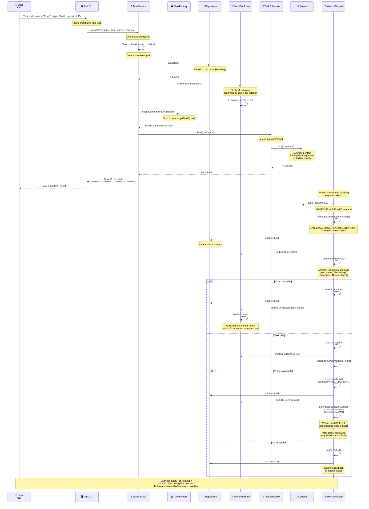
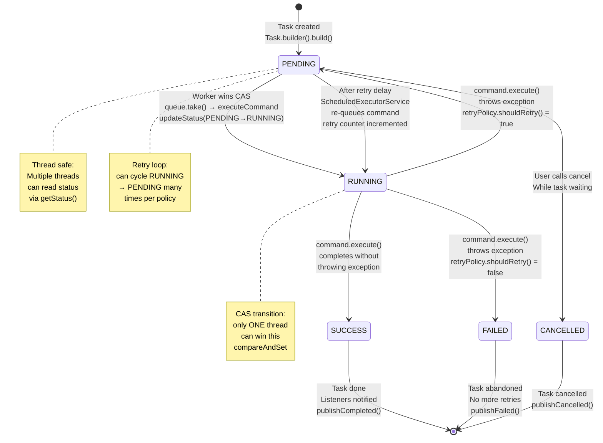
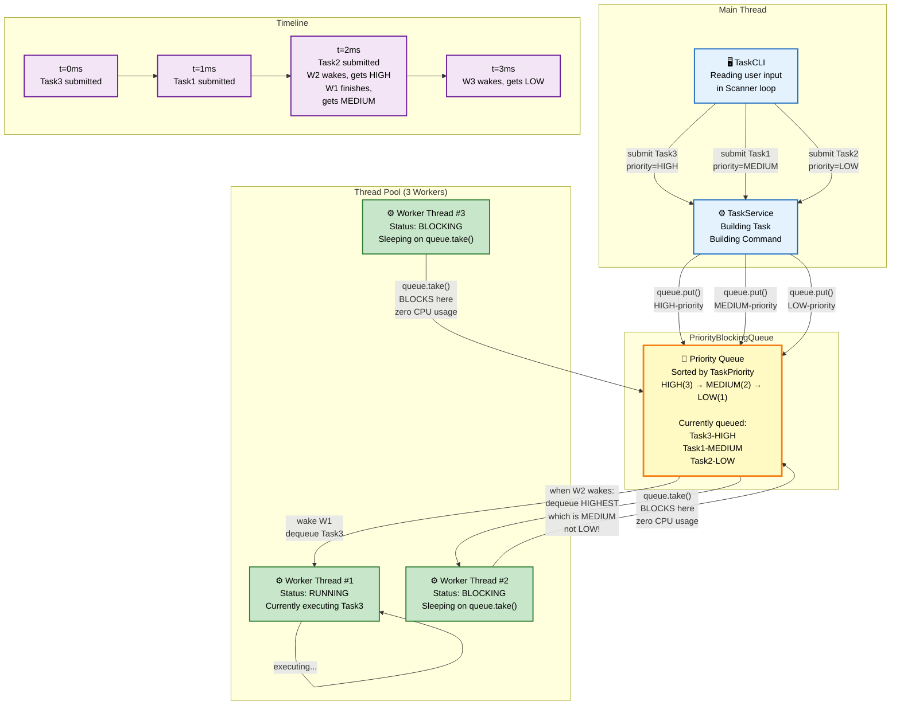

```mermaid
graph TB
    subgraph "USER INTERACTION LAYER"
        CLI["🖥️ TaskCLI<br/>Terminal Interface"]
    end

    subgraph "SERVICE LAYER (Facade)"
        SERVICE["⚙️ TaskService<br/>Orchestration"]
    end

    subgraph "FACTORY LAYER"
        FACTORY["🏭 TaskFactory<br/>Command Creation"]
    end

    subgraph "DOMAIN MODELS"
        TASK["📦 Task<br/>Domain Object<br/>status: AtomicReference<br/>retryCount: AtomicInteger"]
        RESULT["✅ TaskResult<br/>Execution Result"]
    end

    subgraph "DATA LAYER"
        REPO_INT["📋 TaskRepository<br/>Interface"]
        REPO_IMPL["💾 InMemoryTaskRepository<br/>ConcurrentHashMap"]
    end

    subgraph "COMMAND LAYER"
        CMD_INT["🎯 TaskCommand<br/>Interface"]
        ABS_CMD["📝 AbstractTaskCommand<br/>Base Class<br/>Template Method"]
        FILE_CMD["📁 FileProcessingCommand"]
        EMAIL_CMD["✉️ EmailCommand"]
        CLEANUP_CMD["🗑️ DataCleanupCommand"]
        NOTIF_CMD["📢 NotificationCommand"]
    end

    subgraph "RETRY LAYER (Strategy Pattern)"
        RETRY_INT["🔄 RetryPolicy<br/>Interface"]
        NO_RETRY["⏹️ NoRetryPolicy"]
        FIXED_RETRY["⏱️ FixedDelayRetryPolicy<br/>Constant Delay"]
        EXP_RETRY["📈 ExponentialBackoffRetryPolicy<br/>Increasing Delays"]
    end

    subgraph "EVENT SYSTEM (Observer Pattern)"
        PUBLISHER["📢 TaskEventPublisher<br/>Broadcaster"]
        LISTENER_INT["👁️ TaskEventListener<br/>Interface"]
        LOG_LISTENER["📝 ConsoleLogListener<br/>Prints Events"]
        METRICS_LISTENER["📊 MetricsListener<br/>Tracks Statistics"]
    end

    subgraph "CONCURRENCY LAYER (Heart of the System)"
        SCHEDULER["🎪 TaskScheduler<br/>Manager<br/>- PriorityBlockingQueue<br/>- ThreadPoolExecutor<br/>- volatile running flag<br/>- AtomicInteger activeCount"]

        subgraph "Worker Threads (Multiple)"
            WORKER["⚙️ WorkerThread #1<br/>Runnable<br/>queue.take() blocking<br/>CAS status transition"]
            WORKER2["⚙️ WorkerThread #2"]
            WORKER3["⚙️ WorkerThread #3"]
        end

        QUEUE["📮 PriorityBlockingQueue<br/>Sorted by TaskPriority<br/>HIGH → MEDIUM → LOW"]
        SCHEDULER_EXEC["🔧 ScheduledExecutorService<br/>Retry Delays"]
    end

    subgraph "COMPOSITION ROOT"
        MAIN["🚀 Main.java<br/>Wires Everything"]
    end

    %% User Interaction Flow
    CLI -->|"submit task<br/>add --name X --type Y"| SERVICE
    SERVICE -->|"create Task"| TASK
    SERVICE -->|"save Task"| REPO_IMPL
    SERVICE -->|"publish<br/>SUBMITTED"| PUBLISHER
    SERVICE -->|"request command"| FACTORY
    FACTORY -->|"switch on TaskType"| CMD_INT
    FACTORY -->|"build concrete command<br/>FileProcessingCommand etc."| ABS_CMD

    %% Command Implementations
    ABS_CMD -->|"extends"| FILE_CMD
    ABS_CMD -->|"extends"| EMAIL_CMD
    ABS_CMD -->|"extends"| CLEANUP_CMD
    ABS_CMD -->|"extends"| NOTIF_CMD

    %% Service to Scheduler
    SERVICE -->|"submit(command)<br/>queue.put()"| QUEUE
    QUEUE -->|"backed by"| SCHEDULER

    %% Scheduler manages threads
    SCHEDULER -->|"create & start<br/>3 workers"| WORKER
    SCHEDULER -->|"create & start"| WORKER2
    SCHEDULER -->|"create & start"| WORKER3

    %% Worker execution flow
    WORKER -->|"queue.take()<br/>BLOCKS until<br/>work available"| QUEUE
    WORKER -->|"CAS updateStatus<br/>PENDING→RUNNING<br/>Only one wins!"| TASK
    WORKER -->|"fetchTask"| REPO_IMPL
    WORKER -->|"publish<br/>STARTED"| PUBLISHER
    WORKER -->|"execute()"| ABS_CMD

    %% Success Path
    ABS_CMD -->|"success"| TASK
    WORKER -->|"CAS updateStatus<br/>RUNNING→SUCCESS"| TASK
    WORKER -->|"save status"| REPO_IMPL
    WORKER -->|"publish<br/>COMPLETED"| PUBLISHER
    PUBLISHER -->|"notify"| LOG_LISTENER
    PUBLISHER -->|"notify"| METRICS_LISTENER

    %% Failure Path with Retry
    ABS_CMD -->|"throws Exception"| WORKER
    WORKER -->|"publish<br/>FAILED"| PUBLISHER
    WORKER -->|"check shouldRetry()"| RETRY_INT
    RETRY_INT -->|"decide based on<br/>retryCount vs<br/>maxRetries"| NO_RETRY
    RETRY_INT -->|"fixed: always<br/>same delay"| FIXED_RETRY
    RETRY_INT -->|"exponential:<br/>500ms → 1s → 2s → 4s"| EXP_RETRY

    WORKER -->|"if shouldRetry=true<br/>incrementRetry()<br/>reset to PENDING"| TASK
    WORKER -->|"update status"| REPO_IMPL
    WORKER -->|"publish<br/>RETRYING"| PUBLISHER
    WORKER -->|"schedule re-queue<br/>after delayMs"| SCHEDULER_EXEC
    SCHEDULER_EXEC -->|"after delay<br/>re-queue command"| QUEUE

    WORKER -->|"if shouldRetry=false<br/>mark FAILED"| TASK
    WORKER -->|"save final status"| REPO_IMPL

    %% Query Path
    CLI -->|"list --status PENDING"| SERVICE
    SERVICE -->|"findByStatus()"| REPO_IMPL
    REPO_IMPL -->|"stream().filter()<br/>Java 8 Streams"| CLI

    %% Event Broadcasting
    PUBLISHER -->|"loop over all<br/>listeners"| LOG_LISTENER
    PUBLISHER -->|"try-catch per<br/>listener"| METRICS_LISTENER
    LOG_LISTENER -->|"print to stdout"| CLI
    METRICS_LISTENER -->|"AtomicInteger counters<br/>track stats"| CLI

    %% Repository Abstraction
    REPO_INT -->|"interface<br/>implemented by"| REPO_IMPL
    REPO_IMPL -->|"ConcurrentHashMap<br/>lock striping<br/>multiple threads"| TASK

    %% Dependency Injection from Main
    MAIN -->|"new InMemoryTaskRepository()"| REPO_IMPL
    MAIN -->|"new TaskEventPublisher()"| PUBLISHER
    MAIN -->|"addListener ConsoleLogListener"| LOG_LISTENER
    MAIN -->|"addListener MetricsListener"| METRICS_LISTENER
    MAIN -->|"new ExponentialBackoffRetryPolicy<br/>3 retries, 500ms base, 2x multiplier"| EXP_RETRY
    MAIN -->|"new TaskScheduler(retryPolicy, repo, publisher)"| SCHEDULER
    MAIN -->|"scheduler.start(3)<br/>3 worker threads"| WORKER
    MAIN -->|"new TaskService(...)"| SERVICE
    MAIN -->|"new TaskCLI(service)"| CLI
    MAIN -->|"new TaskFactory()"| FACTORY
    SERVICE -->|"gets injected"| FACTORY

    %% Styling
    classDef user fill:#e1f5ff,stroke:#01579b,color:#000,stroke-width:2px
    classDef service fill:#f3e5f5,stroke:#4a148c,color:#000,stroke-width:2px
    classDef factory fill:#fff3e0,stroke:#e65100,color:#000,stroke-width:2px
    classDef domain fill:#e8f5e9,stroke:#1b5e20,color:#000,stroke-width:2px
    classDef data fill:#fce4ec,stroke:#880e4f,color:#000,stroke-width:2px
    classDef command fill:#f1f8e9,stroke:#33691e,color:#000,stroke-width:2px
    classDef retry fill:#ede7f6,stroke:#311b92,color:#000,stroke-width:2px
    classDef event fill:#fce4ec,stroke:#c2185b,color:#000,stroke-width:2px
    classDef concurrency fill:#fff9c4,stroke:#f57f17,color:#000,stroke-width:3px
    classDef composition fill:#b2dfdb,stroke:#004d40,color:#000,stroke-width:2px

    class CLI user
    class SERVICE service
    class FACTORY factory
    class TASK,RESULT domain
    class REPO_INT,REPO_IMPL data
    class CMD_INT,ABS_CMD,FILE_CMD,EMAIL_CMD,CLEANUP_CMD,NOTIF_CMD command
    class RETRY_INT,NO_RETRY,FIXED_RETRY,EXP_RETRY retry
    class PUBLISHER,LISTENER_INT,LOG_LISTENER,METRICS_LISTENER event
    class SCHEDULER,QUEUE,WORKER,WORKER2,WORKER3,SCHEDULER_EXEC concurrency
    class MAIN composition
```

---

## DETAILED FLOW DIAGRAM - USER SUBMITS A TASK



---

## CONCURRENCY DETAIL - HOW CAS PREVENTS DOUBLE EXECUTION

```mermaid
graph LR
    subgraph "Race Condition Scenario"
        Queue["📮 Queue<br/>BOTH threads pull<br/>same Task"]

        T1["Thread 1<br/>Worker #1"]
        T2["Thread 2<br/>Worker #2"]

        Task["📦 Task<br/>status = PENDING"]
    end

    subgraph "What happens"
        T1 -->|"queue.take()<br/>gets command"| Queue
        T2 -->|"queue.take()<br/>gets SAME command<br/>somehow"| Queue

        T1 -->|"CAS: PENDING→RUNNING<br/>compareAndSet<br/>succeeds!"| Task
        T2 -->|"CAS: PENDING→RUNNING<br/>compareAndSet<br/>FAILS! returns false"| Task

        T1 -->|"wasRunning = true<br/>proceeds to execute"| Task
        T2 -->|"wasRunning = false<br/>backs off, returns<br/>no execution"| Task
    end

    subgraph "Result"
        Result["✅ SAFE<br/>Only Thread 1 executes<br/>Thread 2 sees false<br/>and skips"]
    end

    Queue --> T1
    Queue --> T2
    T1 --> Result
    T2 --> Result
    Task -.->|"compareAndSet atomically<br/>checks AND sets in<br/>one indivisible operation"| T1
    Task -.->|"second CAS fails<br/>because status<br/>already changed"| T2

    classDef race fill:#ffcdd2,stroke:#c62828,color:#000,stroke-width:2px
    classDef worker fill:#fff9c4,stroke:#f57f17,color:#000,stroke-width:2px
    classDef safe fill:#c8e6c9,stroke:#2e7d32,color:#000,stroke-width:2px

    class Queue,Task race
    class T1,T2 worker
    class Result safe
```

---

## FULL LIFECYCLE - TASK STATE MACHINE



---

## CONCURRENCY ARCHITECTURE - QUEUE & THREAD INTERACTION



---

## EXCEPTION HANDLING & RETRY FLOW

```mermaid
flowchart TD
    Start["⚙️ WorkerThread.executeCommand<br/>CAS: updateStatus(PENDING→RUNNING)"] --> Exec["▶️ command.execute()<br/>AbstractTaskCommand.doExecute()"]

    Exec -->|"throws any Exception"| CatchEx["❌ catch Exception ex"]

    CatchEx --> HandleFail["🔧 handleFailure<br/>task, ex, command"]

    HandleFail --> PublishFail["📢 eventPublisher.publishFailed<br/>All listeners notified"]

    PublishFail --> CheckRetry{"🤔 retryPolicy<br/>.shouldRetry<br/>task, ex?"}

    CheckRetry -->|"false<br/>retries exhausted OR<br/>dont retry this type"| MarkFailed["🚫 updateStatus<br/>RUNNING→FAILED<br/>setLastError(ex.getMessage)"]

    MarkFailed --> SaveFailed["💾 repository.update<br/>Save final FAILED state"]

    SaveFailed --> LoopBack1["↩️ Worker loops<br/>queue.take()<br/>Ready for next task"]

    CheckRetry -->|"true<br/>retries available AND<br/>shouldRetry agrees"| CalcDelay["⏱️ getDelayMs<br/>retryAttempt"]

    CalcDelay -->|"Fixed: 1000ms<br/>OR<br/>Exponential:<br/>500ms → 1s → 2s → 4s"| Delay["delay = policy.getDelayMs()"]

    Delay --> Publish2["📢 eventPublisher<br/>.publishRetrying"]

    Publish2 --> IncrementRetry["📈 task.incrementRetry<br/>AtomicInteger safe"]

    IncrementRetry --> ResetPending["🔄 updateStatus<br/>RUNNING→PENDING<br/>Ready to run again"]

    ResetPending --> SaveRetry["💾 repository.update"]

    SaveRetry --> Schedule["⏰ ScheduledExecutorService<br/>schedule(() → {<br/>scheduler.submit(command)<br/>}, delayMs)"]

    Schedule --> LoopBack2["↩️ Worker loops<br/>queue.take()<br/>Ready for next task<br/><br/>Meanwhile, in background:<br/>Timer counts down...<br/>After delayMs:<br/>Command re-queued<br/>Back to Start"]

    style Start fill:#e3f2fd,stroke:#1565c0,color:#000,stroke-width:2px
    style Exec fill:#f3e5f5,stroke:#6a1b9a,color:#000,stroke-width:2px
    style CatchEx fill:#ffcdd2,stroke:#c62828,color:#000,stroke-width:2px
    style HandleFail fill:#fff3e0,stroke:#e65100,color:#000,stroke-width:2px
    style PublishFail fill:#fce4ec,stroke:#c2185b,color:#000,stroke-width:2px
    style CheckRetry fill:#fff9c4,stroke:#f57f17,color:#000,stroke-width:2px
    style MarkFailed fill:#ffcdd2,stroke:#c62828,color:#000,stroke-width:2px
    style SaveFailed fill:#fce4ec,stroke:#c2185b,color:#000,stroke-width:2px
    style LoopBack1 fill:#c8e6c9,stroke:#2e7d32,color:#000,stroke-width:2px
    style CalcDelay fill:#e0f2f1,stroke:#00695c,color:#000,stroke-width:2px
    style Delay fill:#e0f2f1,stroke:#00695c,color:#000,stroke-width:2px
    style Publish2 fill:#fce4ec,stroke:#c2185b,color:#000,stroke-width:2px
    style IncrementRetry fill:#e8f5e9,stroke:#1b5e20,color:#000,stroke-width:2px
    style ResetPending fill:#e8f5e9,stroke:#1b5e20,color:#000,stroke-width:2px
    style SaveRetry fill:#fce4ec,stroke:#c2185b,color:#000,stroke-width:2px
    style Schedule fill:#fff9c4,stroke:#f57f17,color:#000,stroke-width:2px
    style LoopBack2 fill:#c8e6c9,stroke:#2e7d32,color:#000,stroke-width:2px
```



---

## KEY CONCEPTS AT A GLANCE

```mermaid
mindmap
  root((🎯 Task Scheduler<br/>Key Concepts))
    🔒 Thread Safety
      AtomicReference
        Task.status
        Compare-And-Set
      AtomicInteger
        Task.retryCount
        MetricsListener counts
      volatile
        running flags
        cross-thread visibility
      ConcurrentHashMap
        lock striping
        Repository storage
      synchronized
        admin operations
        addListener/removeListener
    📮 Queuing & Blocking
      PriorityBlockingQueue
        sorted by priority
        queue.take() blocks
        queue.put() wakes up
      BlockingQueue.take()
        no CPU spinning
        thread sleeps
        wakes on new item
      ScheduledExecutorService
        retry delays
        non-blocking schedule
    🏗️ Design Patterns
      Factory Pattern
        TaskFactory
        one place to build commands
      Strategy Pattern
        RetryPolicy
        NoRetry/Fixed/Exponential
      Observer Pattern
        EventPublisher
        ConsoleLog/Metrics listeners
      Facade Pattern
        TaskService
        hides complexity
      Template Method
        AbstractTaskCommand
        execute() final skeleton
    🔄 Execution Flow
      Task Submission
        CLI → Service → Factory
        → Scheduler → Queue
      Worker Execution
        take() → CAS → execute()
        → success/failure
      Retry Logic
        shouldRetry() decision
        exponential backoff math
        re-queue after delay
    📊 Dependency Injection
      Main.java wiring
      Constructor injection
      All classes receive deps
      Single composition point
```

---

## LEGEND & COLOR MEANINGS

```
🔵 BLUE - User/Input Layer
  TaskCLI, user input handling

🟣 PURPLE - Service/Orchestration Layer
  TaskService coordinates subsystems

🟠 ORANGE - Factory/Creation Layer
  TaskFactory creates commands

🟢 GREEN - Domain/Core Models
  Task, Command objects
  Repository abstraction

🔴 RED/PINK - Data Storage Layer
  InMemoryTaskRepository
  ConcurrentHashMap storage

🟡 YELLOW - Concurrency Core (Most Critical)
  TaskScheduler
  WorkerThread
  BlockingQueue
  Thread synchronization

⚪ WHITE/LIGHT - Events
  EventPublisher
  Listeners
  Notification system

```

All diagrams show:

- **Color coding** for different layers
- **Comments** explaining what's happening
- **Sequence of operations** with timing
- **Thread interactions** and blocking
- **Race conditions** and how they're prevented with CAS
- **Retry flow** with exponential backoff
- **State transitions** for task lifecycle
