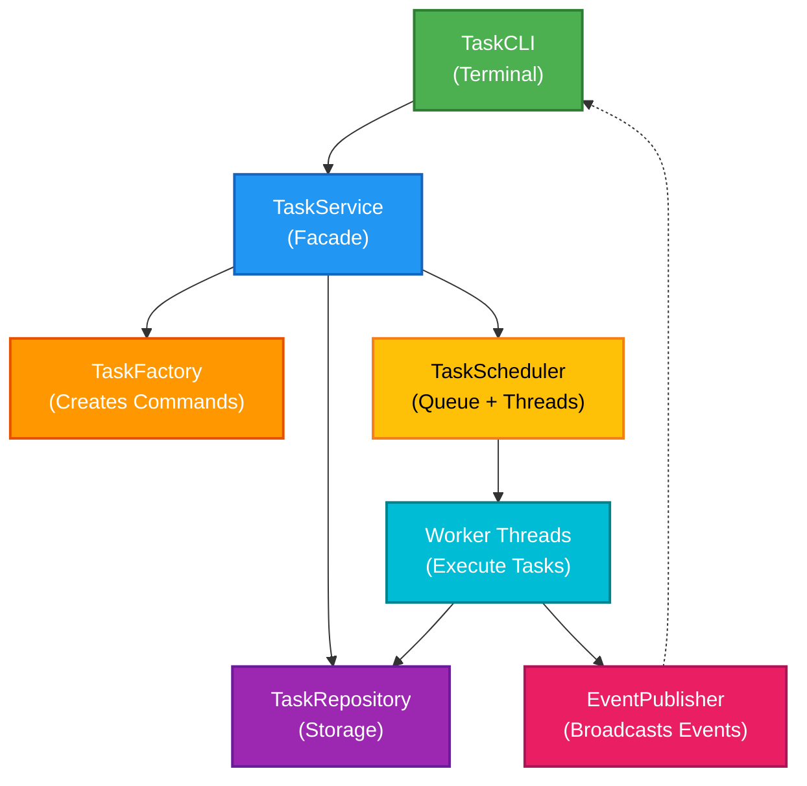
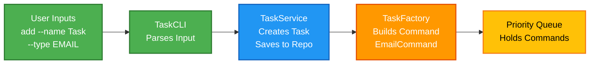
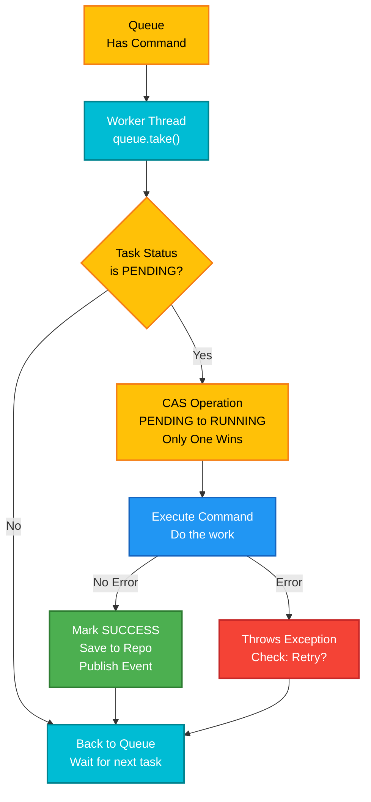
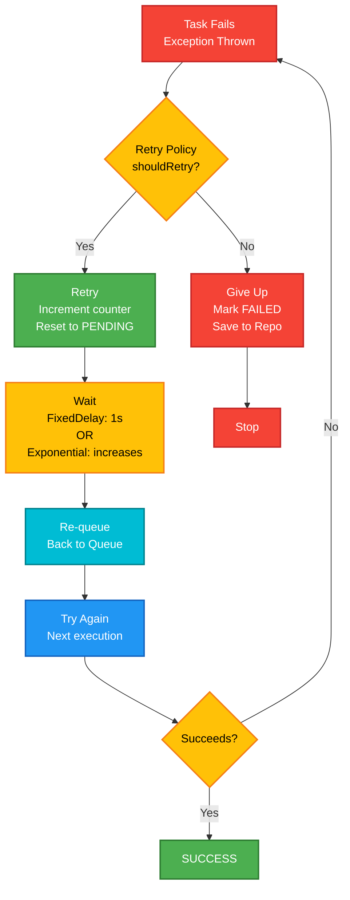
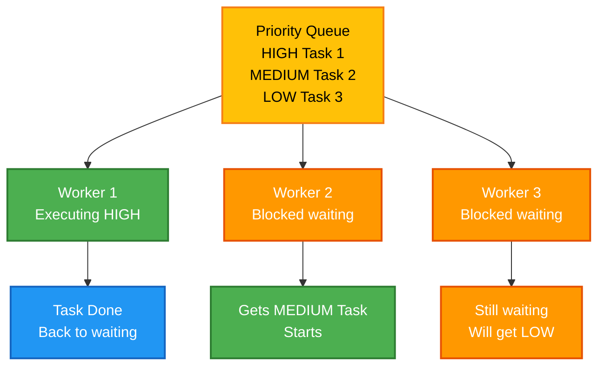
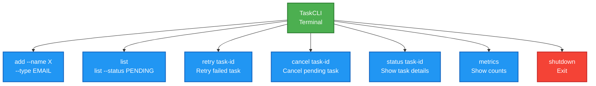
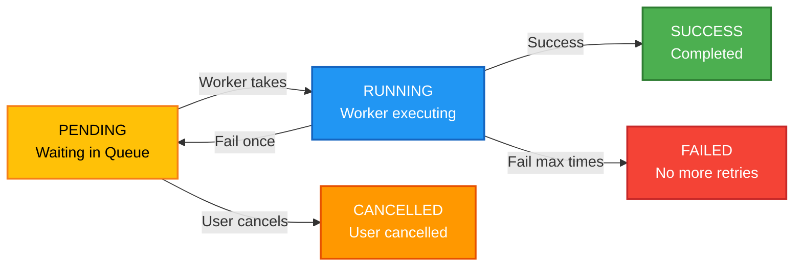
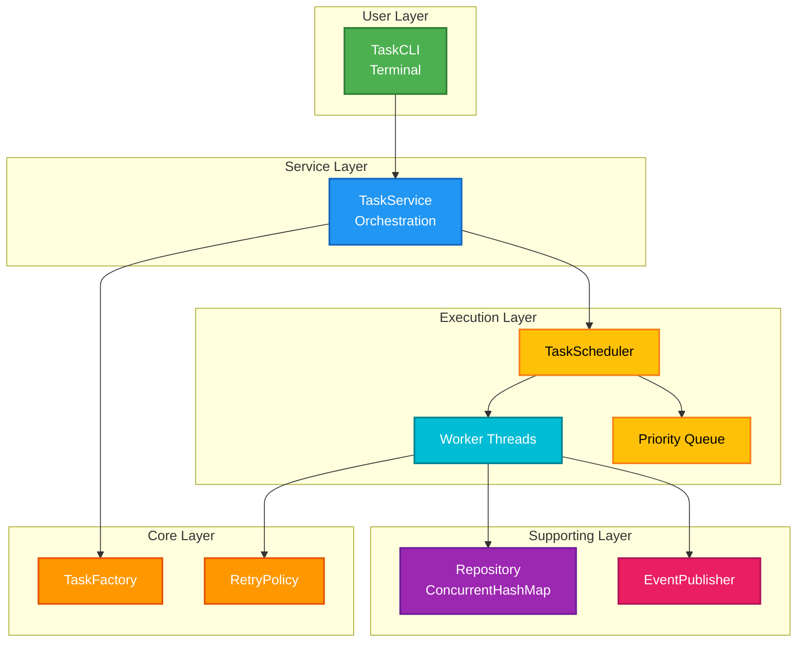
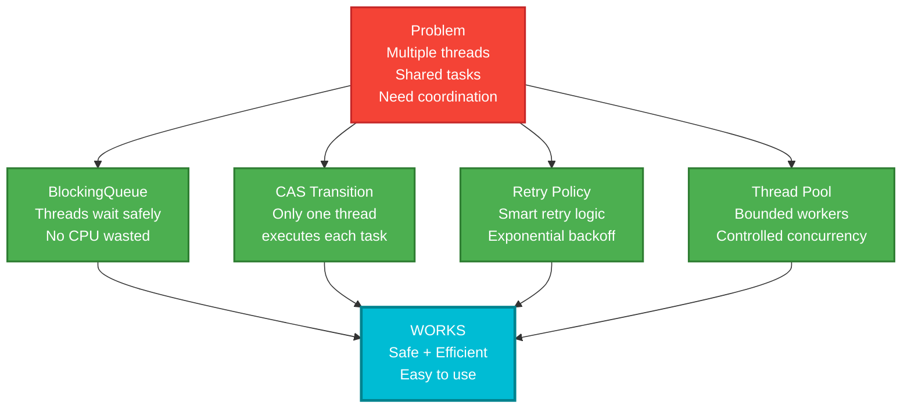

# Simple Task Scheduler Diagrams

## 1. SIMPLE ARCHITECTURE - What Components Exist



---

## 2. SIMPLE TASK SUBMISSION FLOW



---

## 3. SIMPLE TASK EXECUTION FLOW



---

## 4. SIMPLE RETRY FLOW



---

## 5. SIMPLE CONCURRENCY - How Multiple Threads Work



---

## 6. SIMPLE CLI COMMANDS



---

## 7. SIMPLE TASK LIFECYCLE (States)



---

## 8. KEY CONCEPTS - ONE SENTENCE EACH

```mermaid
graph TB
    Atomic["AtomicInteger<br/>Safe read+write<br/>from multiple threads"]
    
    CAS["Compare-And-Set<br/>Only one thread<br/>can win"]
    
    Queue["BlockingQueue<br/>Threads wait here<br/>no CPU spinning"]
    
    Retry["RetryPolicy<br/>Decides: retry or give up<br/>how long to wait"]
    
    Events["Observer Pattern<br/>Publish events<br/>listeners react"]
    
    Factory["Factory Pattern<br/>One place to build<br/>all command types"]
    
    Service["TaskService<br/>Simple interface<br/>hiding complexity"]
    
    style Atomic fill:#2196F3,stroke:#1565C0,color:#fff,stroke-width:2px
    style CAS fill:#FFC107,stroke:#F57F17,color:#000,stroke-width:2px
    style Queue fill:#4CAF50,stroke:#2E7D32,color:#fff,stroke-width:2px
    style Retry fill:#9C27B0,stroke:#6A1B9A,color:#fff,stroke-width:2px
    style Events fill:#E91E63,stroke:#AD1457,color:#fff,stroke-width:2px
    style Factory fill:#FF9800,stroke:#E65100,color:#fff,stroke-width:2px
    style Service fill:#2196F3,stroke:#1565C0,color:#fff,stroke-width:2px
```



---

## 9. LAYERS VISUALIZATION



---

## 10. WHAT MAKES IT WORK - The Secret



---

## COLOR LEGEND

```
🟢 GREEN (#4CAF50)     = Input/Execution/Success
🔵 BLUE (#2196F3)      = Service/Processing
🟠 ORANGE (#FF9800)    = Factory/Creation/Waiting
💛 YELLOW (#FFC107)    = Queue/Core/Decision
🔵 CYAN (#00BCD4)      = Worker Threads
🟣 PURPLE (#9C27B0)    = Storage/Repository
🔴 RED (#F44336)       = Error/Failure/Stop
💗 PINK (#E91E63)      = Events
```